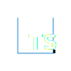

<h1 id="top" align="center">Hi, I'm Mazen Mohammed </h1>

  

<!-- Social Icons -->

  
  &nbsp;&nbsp;&nbsp;&nbsp;&nbsp;
  
  &nbsp;&nbsp;&nbsp;&nbsp;&nbsp;
  
  &nbsp;&nbsp;&nbsp;&nbsp;&nbsp;
  
  &nbsp;&nbsp;&nbsp;&nbsp;&nbsp;

##  About Me

- ⭐ I'm a `Software Engineer` Focused on `Backend Development`.
- 🚀 Passionate about `Software Development` and `Problem Solving.`
- 💡 Interested in `Open Source Projects` and `building impactful projects`.
- 🎯 Dedicated to `building clean`, `scalable`, and `high-quality` solutions.
- 🔍 Currently seeking `Internship` and `Software Engineer` opportunities.
- 📄 Know more about my experiences in my **[Resume](https://drive.google.com/file/d/1yI12juqrG7MFROjmavassqV5YSCLlbjk/view?usp=sharing)**.
- ✨ Thanks for visiting my GitHub profile.

&nbsp;

## 📚 Training Experience

| 🏢 Organization | 💼 Role | ⏰ Duration | 📄 Certificate |
| ---- | --- | --- | --- |
| [Information Technology Institute (ITI)](https://iti.gov.eg/home) | Backend Development using .Net | Aug 2025 - Sep 2025 | [Certificate](certificates/training/iti-react.pdf) |
| [National Telecommunication Institute (NTI)](https://www.nti.sci.eg/) | Software Development using PHP | Jul 2024 - Aug 2025 | [Certificate](certificates/training/iti-python.pdf) |
| [Sprints](https://sprints.ai/en-eg) | Web Development | Jun 2025 - Jul 2025 | [Certificate](certificates/training/iti-web-development.pdf) |
| [ALX](https://www.alxafrica.com/) | AI Career Essentials | Sep 2024 - Oct 2024 | [Certificate](certificates/training/coach-academy.pdf) |

  

##  Social Media

&nbsp;

&nbsp;

&nbsp;

&nbsp;

<!-- 
&nbsp; 

&nbsp; 
 
-->

##  Technical Skills

  
  
  
  
  
  
  
  
  

<!--

  

-->

### 🔨 Languages

   C++
  &nbsp;&nbsp;
   C#
  &nbsp;&nbsp;
   JavaScript
  &nbsp;&nbsp;
   TypeScript
  &nbsp;&nbsp;
   Python

### 🛠️ Backend Technologies

   Node.js
  &nbsp;&nbsp;
   Express
  &nbsp;&nbsp;
   .NET
  &nbsp;&nbsp;
   REST APIs

### 💾 Databases

   PostgreSQL
  &nbsp;&nbsp;
   MongoDB
  &nbsp;&nbsp;
   MySQL
  &nbsp;&nbsp;
   SQL Server
  &nbsp;&nbsp;
   Supabase

### 🖥️ Frontend

   React
  &nbsp;&nbsp;
   Tailwind
  &nbsp;&nbsp;
   Bootstrap
  &nbsp;&nbsp;
   HTML
  &nbsp;&nbsp;
   CSS

### ⚙️ Principles & Tools

  OOP,&nbsp;&nbsp;SOLID,&nbsp;&nbsp;Design Patterns,&nbsp;&nbsp;Testing,&nbsp;&nbsp;Deployment,&nbsp;&nbsp;Data Structures,&nbsp;&nbsp;Algorithms

  <strong>Tools : </strong>
   Linux
  &nbsp;&nbsp;
   Git
  &nbsp;&nbsp;
   Postman
  &nbsp;&nbsp;
   VS Code

<!--
### ☁️ DevOps & Infrastructure

   Docker
  &nbsp;&nbsp;
   Kubernetes
  &nbsp;&nbsp;
   Nginx
  &nbsp;&nbsp;
   AWS
  &nbsp;&nbsp;
  CI/CD
  &nbsp;&nbsp;
  Microservices

-->

## :book: Guest Book

- Leave a message : mazenmohamed3910@gmail.com

<!-- - Ask anything at <a href="https://github.com/ahmednassar7/ahmednassar7/discussions/new/choose">Discussions</a> -->

